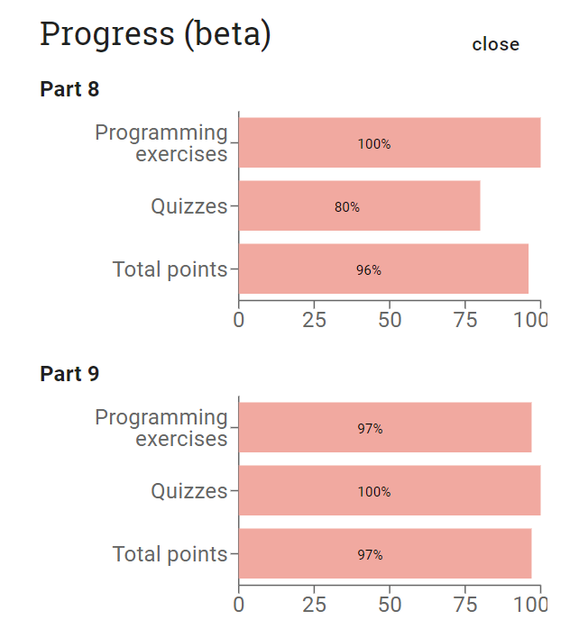

# mooc-java-programming-2part 

This java mooc course part 1 was really crucial in my understandig of core JAVA and helped me to stand on my feet in JAVA world

[Java and NetBeans installation guide needed for this course](https://www.mooc.fi/en/installation/netbeans)

---

## Topics covered in the part 1 course:
- [part8](https://java-programming.mooc.fi/part-8)
- [part9](https://java-programming.mooc.fi/part-9)

---

## IDE: [NeatBeans](https://netbeans.apache.org/) [TMC](https://tmc.mooc.fi/)

## Progress:

